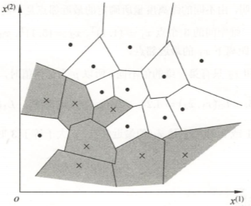
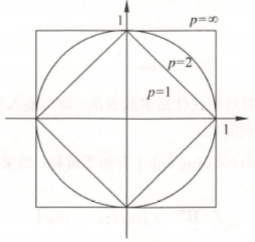
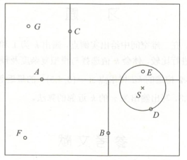

# k近邻法

近邻法是一种基本分类与回归方法，这里只讨论分类问题中的k近邻法。

近邻法输入为实例的特征向量，对应特征空间的点；输出为实例的类别（可取多类）。

## k近邻算法

近邻算法简单、直观；给定一个训练集，对新的输入实例，在训练集中找到与该实例最接近的k个实例，这个实例中多数属于某个类，就把该输入实例分为这个类。

> 输入：训练集
> 

> 其中，为实例的特征向量，为实例的类别，；实例特征向量;
> 
>输出：实例所属的类
> 
>1. 根据给定的距离度量，在训练集中找出与最邻近的个点，涵盖这个点的的邻域记做；
> 
> 2. 在中根据分类决策规则（如多表决策）决定的类别：
>

其中，为指示函数，即当时为1，否则为0。

近邻法的特殊情况是的情形，称为最近邻法。对于输入的实例点（特征向量），最近邻法将训练集中与最近邻点的类作为的类。

近邻法没有显式的学习过程。

---

## k近邻模型

近邻法使用的模型实际上对应于特征空间的划分。模型由三个基本要素——距离度量、值得选择和分类决策规则决定。

### 模型

近邻法中，当训练集、距离度量（如欧式距离）、值及分类决策规则（如多数表决）确定后，对于任何一个新的输入实例，它所属的类唯一的确定。这相当于根据上述要素将特征空间划分为一些子空间，确定子空间里的每个点所属的类。大致分类如下图：

### 距离度量

特征空间中两个实例点的距离是两个实例点相似程度的反映。近邻模型的特征空间一般是维实数向量空间，的距离定义为

这里。当时，称为欧氏距离（Euclidean distance），即

当时，称为曼哈顿距离（Manhattan distance），即

当时，称为曼哈顿距离（Manhattan distance），即

下图给出了二维空间中取不同值时，与原点的距离为的点的图形：

### k值的选择

值的选择会对近邻法的结果产生重大影响。

如果选择较小的值，就会相当于用较小的领域中的训练实例进行预测，“学习”'的近似误差（approximation error）会减小，只有与输入实例较近的（相似的）训练实例才会对预测结果起作用。但缺点是“学习”的估计误差（estimation error）会增大，预测结果会对近邻的实例非常敏感。如果近邻的实例点恰巧是噪声，预测就会出错。简单来说就是，值额减小会使整体模型变得复杂，容易发生过拟合。

如果选择较大的值，就相当于用较大的邻域中的训练实例进行预测。其优点是可以减少学习的估计误差，但缺点是学习的近似误差会增大。这时与输入实例较远的（不相似的）训练实例也会对预测起作用，使预测发生错误。值的增大就意味着整体的模型变得简单。

如果，那么无论输入实例是什么，都将简单的预测它属于在训练实例中最多的类。这时，模型过于简单，完全忽略训练实例中的大量有用信息，是不可取的。

在应用中，值一般取一个比较小的数值，通常采用交叉验证法来选取最优的值。

### 分类决策规则

近邻法中的分类决策规则往往是多数表决，即由输入实例的个邻近的训练实例中的多数类决定输入实例的类。

多数表决规则（majority voting rule）有如下解释：如果分类的损失函数为0-1损失函数，分类函数为

那么误分类的概率是

对给定的实例，其最近邻的个训练实例点构成集合。如果涵盖的区域的类别是，那么误分类率是

要使误分类率最小，即经验风险最小，就要使最大，所以多数表决规则等价于经验风险最小化。

---

## k近邻法的实现：kd树

### 构造kd树

kd树是一种对维空间中的实例点进行存储以便对其进行快速检索的树形数据结构。kd树是二叉树，表示对维空间的一个划分（partition）。构造kd树相当于不断地用垂直于坐标轴的超平面将维空间切分，构成一系列的维超矩形区域。kd树的每个结点对应于一个维超矩形区域。

构造kd树的方法如下：构造根结点，使根结点对应于维空间中包含所有实例
点的超矩形区域；通过下面的递归方法，不断地对维空间进行切分，生成子结点。在超矩形区域（结点）上选择一个坐标轴和在此坐标轴上的一个切分点，确定一个超平面，这个超平面通过选定的切分点并垂直于选定的坐标轴，将当前超矩形区域切分为左右两个子区域（子结点）；这时，实例被分到两个子区域。这个过程直到子区域内没有实例时终止（终止时的结点为叶结点）。在此过程中，将实例保存在相应的结点上。

通常，依次选择坐标轴对空间切分，选择训练实例点在选定坐标轴上的中位数（median）为切分点，这样得到的kd树是平衡的。注意，平衡的kd树搜索时的效率未必是最优的。

下面给出构造kd树的算法：

>输入：维空间数据集；
>
>输出：kd树
>
>1. 开始：构造根结点，根结点对应于包含的维空间的超矩形区域。
>
>   选择为坐标轴，以中所有实例的坐标的中位数为切分点，将根结点对应的超矩形区域切分为两个子区域。切分由通过切分点并与坐标轴垂直的超平面实现。
>
>   由根结点生成深度为1的左、右子结点:左子结点对应坐标小于切分点的子区域，右子结点对应于坐标大于切分点的子区域。
> 
>   将落在切分超平面上的实例点保存在根结点。
>
>2. 重复：对深度为的结点，选择为切分的坐标轴，,以该结点的区域中所有实例的坐标的中位数为切分点,将该结点对应的超矩形区域切分为两个子区域。切分由通过切分点并与坐标轴垂直的超平面实现。
>
>   由该结点生成深度为的左、右子结点：左子结点对应坐标小于切分点的子区域，右子结点对应坐标大于切分点的子区域。
>
>   将落在切分超平面上的实例点保存在该结点。
>
>3. 直到两个子区域没有实例存在时停止。从而形成kd树的区域划分。

### 搜索kd树

kd树可以省去对大部分数据点的搜索，从而减少搜索的计算量。这里以最近邻为例加以叙述，同样的方法可以应用到近邻。

给定一个目标点，搜索其最邻近。首先找到包含目标点的叶结点；然后从该叶结点出发，依次回退到父节点；不断查找与目标点最邻近的节点，当确定不可能存在更近的结点时终止。这样搜索就被限制在空间的局部区域上，效率大为提高。

包含目标点的叶结点对应包含目标点的最小超矩形区域。以此叶结点的实例点作为当前最近点。目标点的最近邻一定在以目标点为中心并通过当前最近点的超球体的内部（参考下图）。然后返回当前节点的父结点，如果父结点的另一子结点的超矩形区域与超球体相交，那么在相交的区域内寻找与目标更近的实例点。如果存在这样的点，将此点作为新的当前最近点。算法转到更上一级的父结点，继续上述过程。如果父结点的另一子节点的超矩形区域与超球体不相交，或不存在比当前最近点更近的点，则停止搜索。

下面叙述用kd树的最近邻搜索算法：

>输入：已构造的kd树，目标点；
>
>输出：的最近邻。
>
>1. 在kd树种找出包含目标点的叶结点：从根结点出发，递归的向下访问kd树。若目标点当前维的坐标小于切分点的坐标，则移动到左子结点，否则移动到右子结点。直到子结点为叶结点为止。
>
>2. 以此叶结点为“当前最近点”。
>
>3. 递归的向上回退，在每个结点进行以下操作：
> 
>   (1). 如果该结点保存的实例点比当前最近点距离目标点更近，则以该实力点为“当前最近点”。
> 
>   (2). 当前最近点一定存在于该结点的一个子结点对应的区域。检查该子结点的父结点的另一子结点对应的区域是否又更近的点。如果有，则移动到另一个子结点。接着，递归的进行最近邻搜索；反则向上回退。
> 
>4. 当回退到根结点时，搜索结束。最后的“当前最近点”即为的最近邻点。

如果实例点是随机分布的，kd树搜索的平均计算复杂度是，这里是训练实例数。kd树更适用于训练实例数远大于维数时的近邻搜索。当空间维数接近训练实例数时，它的效率会迅速下降，几乎接近线性扫描。

---

## 总结

1. 近邻法是基本且简单的分类与回归方法。近邻法的基本做法是：对给定的训练实例点和输入实例点，首先确定输入实例点的个最近邻训练实例点，然后利用这个训练实例点的类的多数来预测输入实例点的类。

2. 近邻模型对应于基于训练数据集对特征空间的一个划分。近邻法中，当训练集、距离度量、值及分类决策规则确定后，其结果唯一确定。
3. 近邻法三要素：距离度量、值的选择和分类决策规则。常用的距离度量是欧氏距离及更一般的距离。值小时，k近邻模型更复杂；值大时，近邻模型更简单。值的选择反映了对近似误差与估计误差之间的权衡，通常由交叉验证选择最优的。常用的分类决策规则是多数表决，对应于经验风险最小化。
4. 近邻法的实现需要考虑如何快速搜索k个最近邻点。kd树是一种便于对维空间中的数据进行快速检索的数据结构。kd树是二叉树，表示对维空间的一个划分，其每个结点对应于维空间划分中的一个超矩形区域。利用kd树可以省去对大部分数据点的搜索，从而减少搜索的计算量。